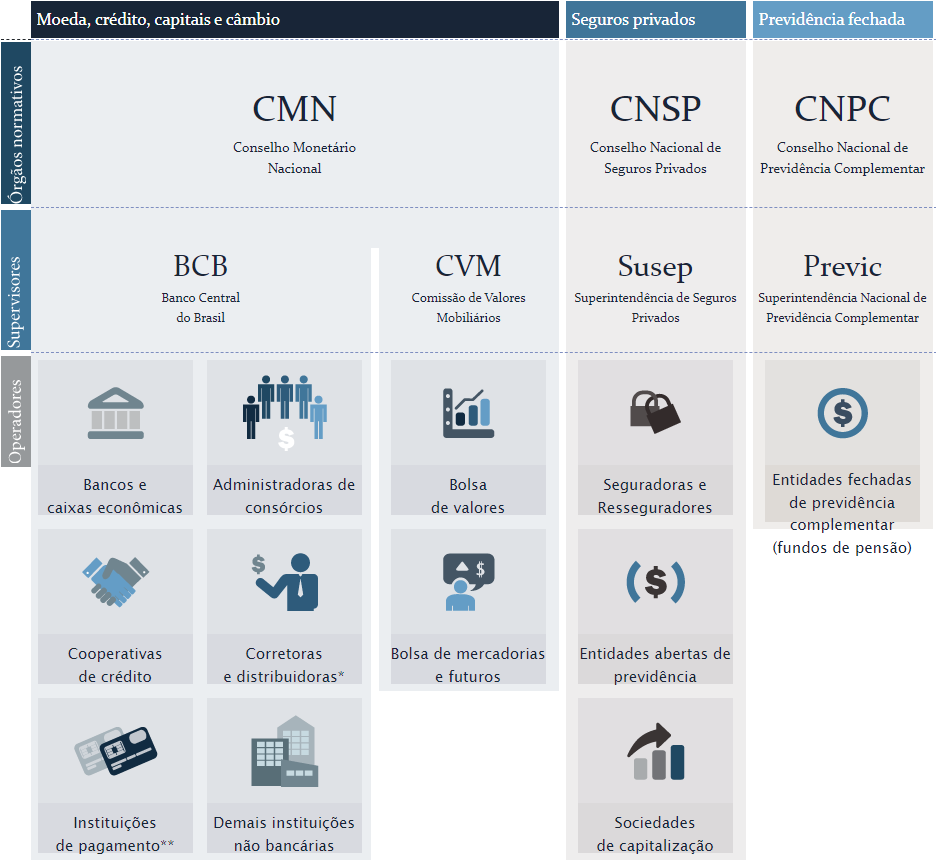

# Sistema Financeiro Nacional

É um conjunto de órgãos que **regulamenta**, **fiscaliza** e **executa** as operações necessárias à circulação da moeda e  do crédito na Economia.

É por meio do sistema financeiro que as pessoas, as empresas e o governo circulam a maior parte dos seus ativos, pagam suas dívidas e realizam seus investimentos.

## Agentes econômicos superavitários e os deficitários de recursos

- **Agente Superavitário**:
  - Possui recurso disponível.
  - Empresta seu dinheiro em uma Instituição Financeira
- **Sistema Financeiro Nacional**:
  - Conjunto de Instituições que vabilizam essa transferência de recursos.
  - Possui regulamentação e fiscalização para dar mais garantia e também solidez aos negócios realizados.
- **Agente Deficitário**:
  - É tomador de recursos.
  - Possui dificuldades financeiras ou falta de capital de investimentos.

## Organização

-  **órgãos normativos**: determinam regras gerais para o bom funcionamento do sistema.
-  **entidades supervisoras**: trabalham para que os integrantes do sistema financeiro sigam as regras definidas pelos órgãos normativos.
-  **operadores**: são as instituições que ofertam serviços financeiros, no papel de intermediários.

## Mercado de Moeda, Crédito e Câmbio

**mercado monetário**: é o mercado que fornece à economia papel-moeda e moeda escritural, aquela depositada em conta-corrente;

**mercado de crédito**: é o mercado que fornece recursos para o consumo das pessoas em geral e para o funcionamento das empresas;

**mercado de câmbio**: é o mercado de compra e venda de moeda estrangeira.

- **Órgão Normativos**:
  - CMN (Conselho Montetário Nacional)
- **Órgão Supervisores**:
  - BACEN (Banco Central do Brasil)
- **Operadores**:
  - Bancos e caixas econômicas
  - Administradores de Consórcio
  - Cooperativas de Crédito
  - Corretoras e distribuidoras
  - Instituições de Pagamento
  - Demais instituições não bancárias

As Instituições de Pagamento não compõem o SFN, mas são reguladas e fiscalizadas pelo BCB, conforme diretrizes estabelecidas pelo CMN.

## Mercado de Capitais

É o mercado que permite às empresas em geral captar recursos de terceiros e, portanto, compartilhar os ganhos e os riscos;

- **Órgão Normativos**:
  - CMN (Conselho Montetário Nacional)
- **Órgão Supervisores**:
  - BACEN (Banco Central do Brasil)
  - CVM (Comissão de Valores Mobiliários) 
- **Operadores**:
  - Bolsa de valores
  - Bolsa de mercadorias e futuros

Dependendo de suas atividades corretoras e distribuidoras também são fiscalizadas pela CVM.

## Mercado de Seguros Privados

**mercado de seguros privados**: é o mercado que oferece serviços de proteção contra riscos;

**previdência complementar aberta**: é um tipo de plano para aposentadoria, poupança ou pensão. Funciona à parte do regime geral de previdência e aceita a participação do público em geral.

**contratos de capitalização**: são os acordos em que o contratante deposita valores podendo recebê-los de volta com juros e concorrer a prêmios.

- **Órgão Normativos**:
  - CNSP (Conselho Nacional de Seguros Privados)
- **Órgão Supervisores**:
  - Susep (Superintendência de Seguros Privados)
- **Operadores**:
  - Seguradoras e Resseguradoras,
  - Entidades abertas de previdência,
  - Sociedades de capitalização

## Mercado de Previdência Fechada

Voltado para funcionários de empresas e organizações. O ramo dos fundos de pensão trata de planos de aposentadoria, poupança ou pensão para funcionários de empresas, servidores públicos e integrantes de associações ou entidades de classe.

- **Órgão Normativos**:
  - CNPC (Conselho Nacional de Previdência Complementar)
- **Órgão Supervisores**:
  - Previc (Superintendência Nacional de Previdência Complementar)
- **Operadores**:
  - Entidades fechadas de previdência complementar (fundo de pensões)
