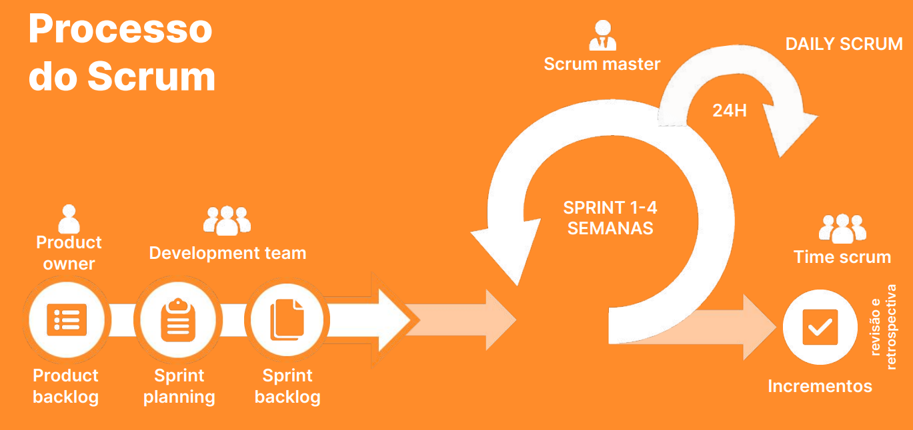
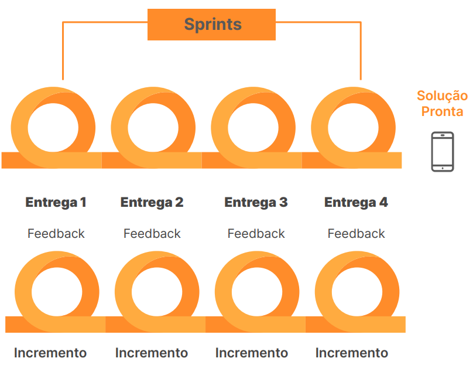

# O que é Scrum

## O que é Scrum?

Meio de gerenciar projetos de forma ágil

### Processo dinâmico e colaborativo

- Planejamento
- Execução
- Inspeção
- Adaptação

Trabalhar em um produto em ciclos curtos possibilita um feedback inicial do usuário, permitindo que você possa eliminar imediatamente tudo aquilo que constitui um desperdício de esforço

## Benefícios do Scrum

- Agilidade
- Colaboração, comunicação e adaptação do time a mudanças
- Melhor gestão de equipes
- Menor desperdício de recursos
- Identificação dos gargalos do projeto
- Motivação dos colaboradores

## Os 3 pilares do Scrum

- **Transparência**: Informação acessível a todos os envolvidos no projeto.
- **Inspeção**: Verificações constantes do processo de projeto.
- **Adaptação**: Adaptar o processo e/ou produto quando necessário.

## Valores

- Compromisso
- Foco
- Abertura
- Respeito
- Coragem

## Framework Scrum

### Papéis

Ocupação de cada membro do time

- Scrum Master,
- Product Owner,
- Development Team

### Artefatos

Informações essenciais para o andamento do projeto

- Product Backlog,
- Sprint Backlog,
- Incrementos

### Eventos

Encontros fixos do time

- Sprint Planning
- Sprint, Daily Scrum
- Sprint Review 
- Sprint Retrospective.

## Processo do Scrum

### Responsabilidades da pessoa Product Owner

- Definir requisitos do produto
- Alinhar as entregas do time
- Gerenciar e atualizar product backlog
- Iniciar e/ou cancelar uma Sprint

### O Scrum Master deve

- Aumentar a autonomia do time Scrum
- Ter conhecimento técnico sobre Scrum
- Entender e saber lidar com pessoas

### Responsabilidades do Scrum Master

- Garantir os valores, práticas e regras do Scrum
- Remover barreiras
- Dar feedbacks
- Garantir a produtividade do time
- Organizar e facilitar eventos Scrum

### Responsabilidades do time de desenvolvimento

Os desenvolvedores mais efetivos são aqueles que se envolvem e se engajam integralmente. Desde o entendimento dos problemas a serem resolvidos até a definição, a mplementação e a validação de soluções, trabalhando lado a lado com Product Owner, clientes, usuários e demais partes interessadas durante todo o processo.

- Elaborar um plano para a Sprint (Sprint Backlog)
- Determinar tecnicamente um incremento
- Coordenar e executar seu próprio trabalho
- Garantir a melhoria contínua do produto
- Informar impedimentos

## Elementos centrais do Scrum

### Product backlog

- **Meta do produto**: objetivo geral do produto. Definida pelo Product Owner, orienta o trabalho do time de desenvolvimento

Conteúdo:

- Necessidades/Desejos de usuários
- Objetivos do negócio/stakeholders
- Limitações do projeto
- Recursos e funcionalidades
- Melhorias e/ou correções
- Detalhes do tipo de produto/solução

Como criar eficiente:

- Focar no usuário/cliente
- Priorizar itens do backlog
- Atualizar o backlog
- Ter clareza e objetividade
- Incluir o time de desenvolvimento
- Revisar o backlog

### Sprint Planning

Propósito:

- O que será entregue (objetivo da sprint)
- Como será entregue (plano para atingir esse objetivo)

Como realizar uma Sprint Planning?

- **Time box**: Definir a duração da reunião. Até 8h para uma Sprint de um mês.
- **Preparação**: Discutir as prioridades do product backlog
- **Objetivo**: Entender o que deve ser entregue na sprint

Como realizar uma Sprint Planning?

- **Sprint Backlog**: Selecionar quais itens do product backlog serão trabalhados na Sprint
- **Meta da Sprint**: Resumir o trabalho que deve ser realizado na Sprint
- **Plano de ação**: Definir tarefas e responsabilidades

### Sprints

Evento com duração fixa - 2 a 4 semanas

- **Definição de pronto**: Compromisso de cada incremento. Critérios que consideram o trabalho da Sprint apto para ser entregue ao usuário/cliente.

### Sprint Review

- Apresenta o produto entregue na sprint.
- Revisão e feedback do produto
- Time e convidados
- Resultado: Feedback

### Sprint Retrospective

- Avaliação do trabalho feito na sprint.
- Avaliação do processo de trabalho
- Time scrum
- Resultado: Plano de ação
