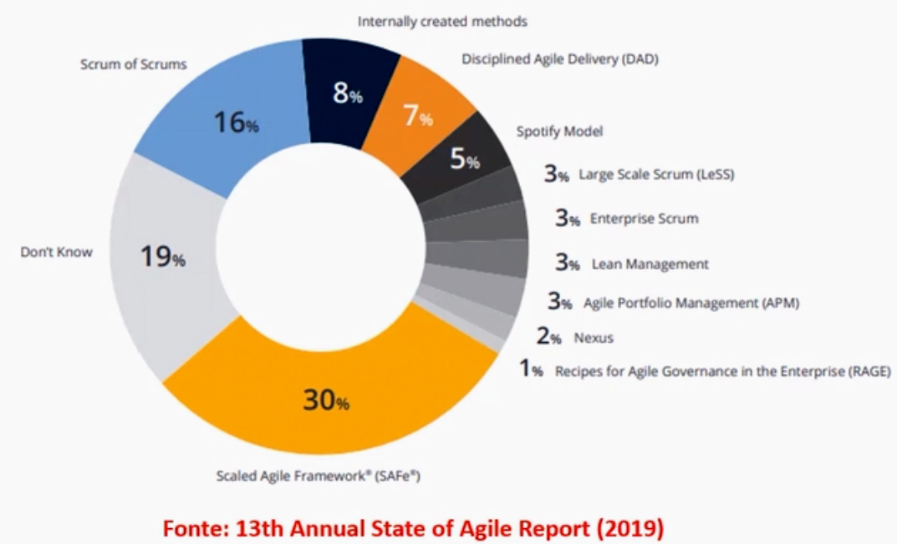
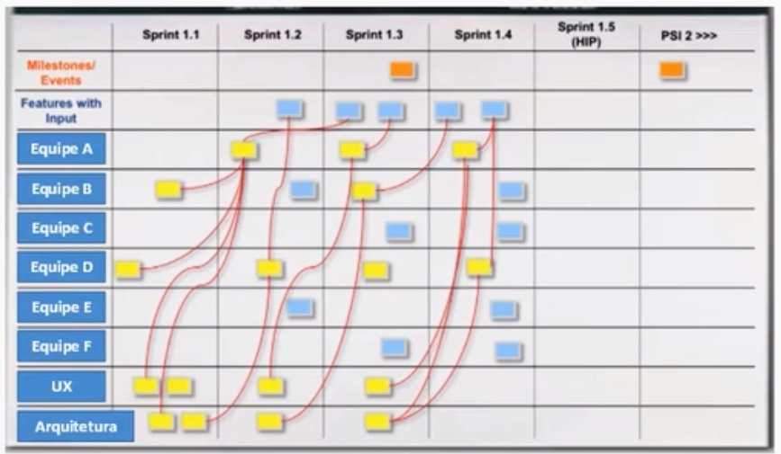

# Expansão dos horizontes do Ágil

## O Ágil escalado

### Características do método ágil tradicional Scrum

Requisitos -> Proeto -> Construção -> Testes -> Lançamento -> Requisitos ....

- Iteratividade
- Mais feedback
- Produto incremental
- Processo empírico
- Menos prescrição
- Equipes auto-gerenciadas e multifuncionais
- Equipe com 5 a 9 de membros - reduzidos

### Ágil Escalado

Utilizar o ágil para empreitadas maiores.

Empreitadas maiores:

- Desenvolvimento de grandes soluções
- Portfólio de numerosas frente interligadas

É necessários que N equipes ágeis tradicionais trabalhem em paralelo. **Integração** entre as equipes pequenas.

- **Ágil Escalado**: N equipes
- **Ágil Discreto**: equipes pequenas scrum tradicional

### Integração

Envolve manter sincronizadas as frentes de trabalho das equipes de Ágil discreto. **Dependências** entre elas precisam ser visualizadas e tratadas.

### Escalação

O Ágil Escalado tem um modelo top-down de decomposição (**escalação**) de papéis e artefatos.

### Framework

Existem frameworks que trata basicamente da **integração** e da **escalação** das frentes de desenvolvimento.

## Ágil em grandes empreitadas

O que é mais importante para conseguirmos utilizar a Ágil em grandes empreitadas, que exigem várias dezenas de pessoas trabalhando concomitantemente?

**Usar N equipes ágeis e promover um esforço de integração entre os trabalhos delas.** O Ágil Escalado, que se propõe a utilizar o Ágil em empreitadas maiores, trabalha com N equipes menores e elementos (artefatos, cerimônias e papéis) que promovem a integração do trabalho, ou seja, mapeiam e tratam as interdependências.

- Usar o Lean associado ao Ágil – a chamada cultura Lean-Ágil  é um alicerce, mas não é isto somente o que garante o sucesso de equipes com muitas pessoas que têm de trabalhar em paralelo. É preciso lançar mão de um método.
- O comprometimento da equipe é importante, mas falarmos de “equipe ágil única” é estranho, pois uma das características de uma equipe ágil é exatamente seu “pequeno” tamanho. Equipes muito grandes (com dezenas de pessoas trabalhando em um único sprint, por exemplo) teriam dificuldade no autogerenciamento.
- Blocos maiores não garantem que o grande número de pessoas que estão trabalhando em paralelo o fizeram de forma harmoniosa, gerando um produto grande consistente.

## Estruturas e componentes da escalação do Ágil

### Escalação e integração

Tod framework de Ágil Escalado usa os elementos:

- Artefatos
- Cerimônias
- Papéis

### Artefato

Program Board do Framework SAFe - contribui para a **integração** das equipes.

Os artefatos possuem uma organização **top-down** de escalação:

Visões -> Grandes temas -> Épicos -> User stories 

### Cerimônias

**Scrum de Scrums (SoS)**: 

- Cada equipe Scrum de Ágil discreto disponibiliza um representante, esses representantes se reúnem e fazem um Scrum, fazem uma reunião diária representando cada um à sua equipe. E nessa reunião ocorre o fenômeno da integração.
- Uma das coisas que é discutida na reunião desses representantes de equipe é que tipo de trabalho uma equipe está focando ou vai precisar colocar no caminho da outra, quais são as interdependências. Essa é a ideia do Scrum de Scrums.

**Reunião diária do Nexus**:

**PO Sync (SAFe)**:

- É uma reunião onde os POs se reúnem e discutem as interdependências entre as features que eles estão desenhando.
- Vão identificar as precedências e as necessidades de um blackdog com relação ao outro.
 
**ART Sync (SAFe)**: 

-  **A**gile **R**elease **T**rain que é um conjunto de equipes Ágeis discretas trabalhando em conjunto
-  Tem aquele objetivo de identificar as interdependências entre essas equipes, atualizando o Program Board.

### Papéis

Papéis no Ágil Escalado também tem uma estrutura de escalação top-down. 

- **Epic Owners** que é um nível mais alto
- **Solution Train Engineer** e o **Release Train Engineer** nível intermediário
- **Scrum Master tradicional** níveis mais baixos e mais operacionais

### Entregas

As entregas também são **incrementais**, mas são maiores.

- Incremento integrado - Nexus
- PI - Program Incremente - SAFe

As iterações têm timeboxes maiores (até 4 semanas), escalando e integrando sprints menores.

## Ágil e negócios

Para introduzir o Ágil em uma área de negócios, convém lembrar que o Ágil é mais do que um método – é também cultura. O uso de um método ágil não garante sozinho o sucesso do Ágil e nas áreas de negócio isto é mais crítico ainda, pois o método pode não ter aderência com o tipo de produto.

- O Scrum é um método ágil para desenvolvimento de produtos complexos. Nem sempre este é o contexto de uma área de negócios.
- Há áreas de negócios onde os produtos em desenvolvimento não são aderentes ao ágil. Por exemplo, uma unidade de negócios de uma indústria siderúrgica.
- Podemos conseguir difundir o Ágil em uma área de negócios através da escalação induzida do Ágil (o uso de um programa de transformação).

## Escalações do Ágil espontânea e induzida

