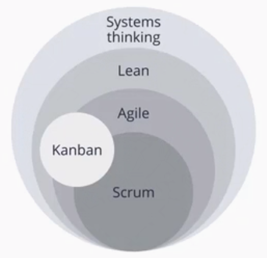
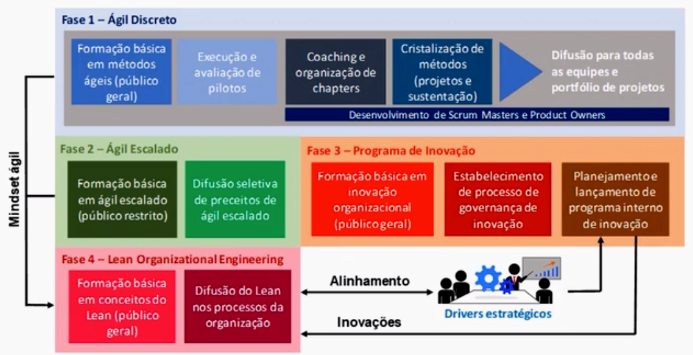

# Convergência Lean-Ágil

## Um pouco de história

- anos 40 - Japão derratadi 2º grande guerra
- caminho escolhido: a excelência em manufatura
- Cria a JUSE (sindicato de engenheiros), desenvolve nas temáticas **Qualidade** e **Produtividade**.
- Afloraram o modelo de qualidade japonês, o **Kaban**, o **Just in Time**, o **Kaizen** e o **Lean**
- anos 80 - Toyota Corollas invadindo os EUA

### anos 2000 - manifesto Ágil de Software
- Foco em entrega de valor ao cliente
- Eliminação de desperdícios

O ágil tem fortíssima inspiração no Lean

## Congruências conceituais entre Lean e Ágil

Muitíssimo do Ágil foi inspirado do Lean.

### Lean e Ágil

- Lean:
  - Valor ao cliente
- Àgil
  - Foco em entrega de software operativo
  - Entregas frequentes
  - Integração contínua

- Lean:
  - Combate a desperdício
- Àgil
  - Menor nível de prescrição
  - Documentação enxuta
  - DevOps

- Lean:
  - Melhoramento contínuo
- Àgil
  - Retrospectivas
  - Gestão empírica (descobrir o caminho com base na experiência)

- Lean:
  - Respeito às pessoas
- Àgil
  - Transparência
  - Equipes autogerenciadas - confiar nas pessoas

- Lean:
  - Células de trabalho
- Àgil
  - Equipes multifuncionais

- Lean:
  - Engenharia paralea (simultânea)
- Àgil
  - Refinamento

- Lean:
  - Trabalho padronizado
- Àgil
  - Cerimônias
  - Padrões de arquitetura técnica

- Lean:
  - Gerenciamento visual
- Àgil
  - Taskboard / painel do projeto

- Lean:
  - Heijunka - balanceamento de recursos
- Àgil
  - Cadência / "sustainable pace"

- Lean:
  - Produção puxada
- Àgil
  - Carga no sprint pela equipe executora
  - Uso do Kanban para atender demandas

- Lean:
  - Lotes pequenos
- Àgil
  - Pulverização das user stories
  - Sprints curtos

- Lean:
  - Sensei Lean - orientador
- Àgil
  - Agile Coach

- Lean:
  - Jidoka - Autonomação
- Àgil
  - Testes automatizados
  - Deploys automatizados

## Qual a relação entre os movimentos Lean e Ágil? 

Surgiram em épocas diferentes e em indústrias diferentes, mas compartilham de princípios semelhantes e pode-se dizer que o Ágil foi muito influenciado pelo Lean.

## Um roadmap de transformação Lean-Ágil

## Fase 1 - Ágil Discreto

Começar em TI, para lançar uma semente.

- **Chapters**: grupos de pessoas com papel semelhantes (PO, Scrums masters)

### Fase 2 - Ágil Escalado

### Fase 3 - Programa de Inovação

Introduzir uma vitamina para o melhoramento contínuo.

### Fase 4 - Lean

## Transformação Lean-Ágil

- A transformação envolve tanto aspectos culturais quanto metodológicos.
- A transformação necessita de um roadmap.
- A transformação pode ser mais ou menos desafiadora dependendo do tipo de empresa.

## Tendências: Ágil como "BAU" e contextos desprojetizados

BAU - **B**usiness **A**s **U**sual

### contextos desprojetizados

Fazer algo logo > Ver o que acontece > Aprender > Seguir / pivoar

### Foco em valor, processos enxutos e combate a desperdícios.

Projetos são atividades “meio”, que não adicionam valor em si aos produtos. Pelo contrário, o atendimento às suas restrições naturais (prazo, escopo fixo, orçamento rígido, KPIs) podem roubar energias que seriam dedicadas ao produto. Remover então os rituais e prescrições de projetos enxugam a produção e convidam a uma visão product-based, mais alinhada à entrega de valor.
