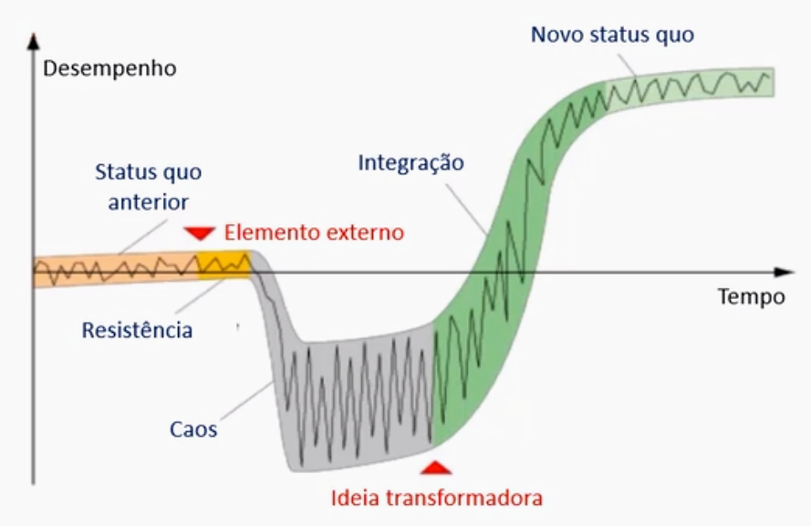
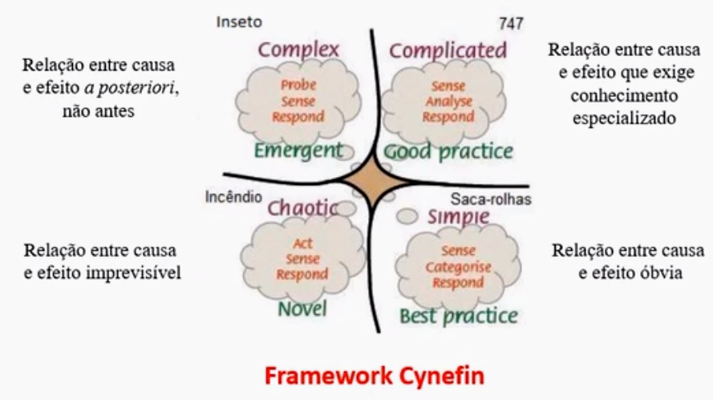

# Anatomia da resistência

## Modelo de mudança de Virginia Satir

* As pessoas gostam de mudar quando a mudança parte delas!

## Modelo de mudança de 8 passos - Kotter

- Criar urgência
- Criar uma coalisão poderosa
- Criar uma visão para a mudança
- Comunicar a visão
- Remover obstáculos
- Criar metas de curto prazo
- Trabalhar na mudança
- Ancorar a mudança na cultura corporativa

## Apoio da alta administração

A alta administração tem “cacife” para correr os riscos ligados ao processo e poder de financiar as iniciativas, além de dar exemplos. 

O processo de transformação apesenta riscos e normalmente trará uma turbulência no início, fatos que os níveis mais baixos da organização podem temer bancar. Além disto, o poder de financiar o programa é uma prerrogativa natural da cúpula. Finalmente, de fato é muito importante o exemplo de engajamento vindo de cima.

- A execução da transformação Lean-Ágil depende de todos os níveis da organização.
- Um processo de transformação Lean-Ágil não é algo que depende de autoridade vinda de cima. Pelo contrário, se não for um movimento baseado em convencimento pode não funcionar.
- O maior conhecimento sobre o negócio não é necessariamente detido pela alta administração. Na verdade, o oposto muitas vezes ocorre.

## A questão da confiança

O Lean-Ágil preconiza alguns ponto que exigem confiança da organização com relação a seus membros:

- Auto-gerenciamento
- Eliminação de avaliação de desempenho por metas individuais
- eliminação de rituais de controle

**Compromentimento** a chave da confiança

## Alguns conceitos arraigados

- Não adianta - as pessoas precisam de chefia
- O escritório é um espaço de rreunião fundamental para evitar dispersão
- As pessoas precisam ser controladas para produzir mais
- Restrições de projeto. cp,p escopo, prazo e custos fixos evitam |"corpo mole"
- O dinheiro motivo
- Metodologia, modelos de gestão, rituais de melhoria contínua... Tudo balela - o que interessa é produzir e vender

## Situações de baixa aderência

### O ágil ser aplicaq ao desenvolvimento de produtos complexos

### O Lean já apresenta maior universalidade

- Valor é adicionado por produtos e serviços complexos, complicados e simples
- Em tudo poder haver desperdícios a eliminar
- Tudo pode ser melhorado
- O repeito às pessoas cabe em qualquer contexto
