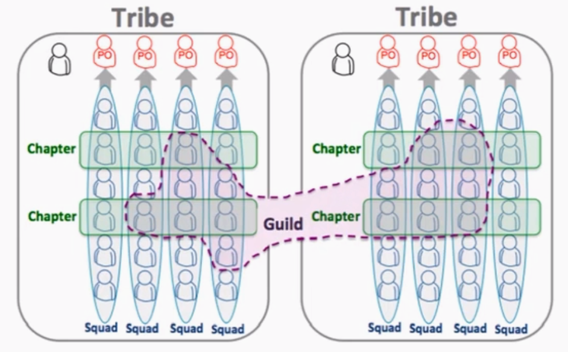

# Estudos de caso de transformação Lean-Ágil

## Spotify

### Aspecots culturais

- Combate ao medo, politicagem e ego
- Foco na motivação
- Confiança maior que controle
- Foco em inovação
- **Fail Wall**: Celebração de falhas - exposição de falhas
- Data Driven Decision em vez de opinião Ego e autoridade
- Melhoramento contínuo

### Itens a eliminar

- Cronogramas
- Papelada
- Fases / equipes de testes apartadas
- Reuniões inúties
- Estimativas de tarefas

### Entrega de valor

- Releases pequenos, frequentes, com qualidade e baixo acoplamento
- Decoupled releases
- Features toggles - indicador liga/desliga

## Chapters

Visam discutir temas relacionados a um papel. Um chapter é constituído por pessoas de mesmo papel de diferentes equipes, que trocam ideias sobre suas funções e como suas atuações podem contribuir mais para o contexto ágil.

## Flagrantes de erros na evolução para o Ágil fora da TI

- A cultura é o aspecto mais importante. Não é somente adotar um método ágil (como o Scrum)

## Retrospectivas

A retrospectiva carrega muito de cultura do Ágil e tem universalidade, como o Kaizen do Lean. Em qualquer contexto faz sentido discutir o que deu certo, o que deu errado e o que pode ser feito para melhorar.
