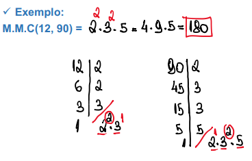
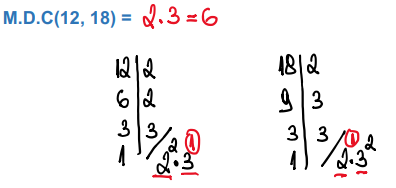

# Mínimo Múltiplo Comum e Máximo Divisor Comum

## MMC - Mínimo Múltiplo Comum

É o menor número que é múltiplo dos dois ao mesmo tempo. Com exceção do 0.

- Múltiplo(3) = { 0, 3, 6, 9, **12** ...}
- Múltiplo(4) = { 0, 4, 8, **12** ...}

### Decomposição em fatores primos - maior expoente

- Decompões dos números em fatores primos separadamente
- MMC é igual ao produto dos fatores primos (comuns e não comuns) elevados aos **maiores** expoentes

## MDC - Máximo Divisor Comum

É o maior número que divide os números dados exatamente. 

Se não houver nenhum número que os divida, além da unidade, o MDC é 1 e os números considerados são primos entre si.

- Divisor(3) = {1,**3**}
- Divisor(6) = {1, 2, **3**, 6}

### Decomposição em fatores primos - menor expoente

- Decompões dos números em fatores primos separadamente
- MMC é igual ao produto dos fatores primos (comuns e não comuns) elevados aos **menores** expoentes

