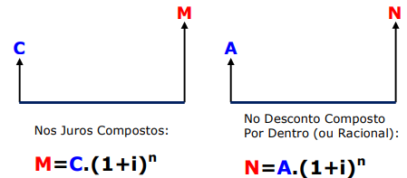

# Descontos Compostos

- **n**: Tempo
- **i**: Taxa
- **N - Valor Nominal**: o que está escriot na face do **título**
- **A - Valor Atual**: o que será pago ou recebido
- **Desconto**: diferença do Valor Nominal e o Valor Atual

## Desconto Composto Racional - Por Dentro

