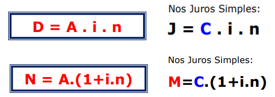
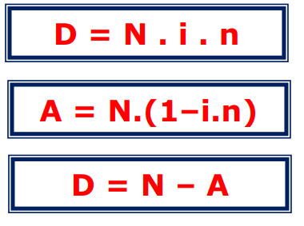
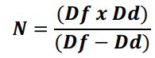
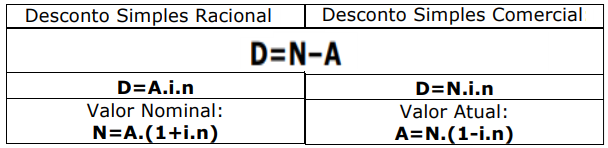

# Descontos Simples

A noção de desconto está diretamente ligada à ideia de **antecipação de tempo** (pagamento de alguma obrigação, resgate de algum título).

- **n**: Tempo
- **i**: Taxa
- **N - Valor Nominal**: o que está escriot na face do **título**
- **A - Valor Atual**: o que será pago ou recebido
- **Desconto**: diferença do Valor Nominal e o Valor Atual

## Modalidades

- **Desconto Simples Racional**: ou Desconto Simples **por dentro**
- **Desconto Simples Comercial**: ou Desconto Simples **por fora**

## Desconto Simples Racional (Por Dentro)

- É a operação irmã dos Juros.
- Descontos por dentro traz de volta (enquantos os juros levam).
- Incide sombre o **Valor Atual**

## Desconto Simples Comercial (Por Fora)

A taxa incidirá **sobre o Valor Nominal**. Feito no comércio, instituições financeiras.

### A relação entre os descontos

Este atalho surgirá quando a questão pedir a relação entre os valores do **Desconto Simples por Dentro (Racional)** e do **Desconto Simples por Fora (Comercial)**.

### A relação entre as taxas

### Relação entre Descontos e Valor Nominal

## Resumo

