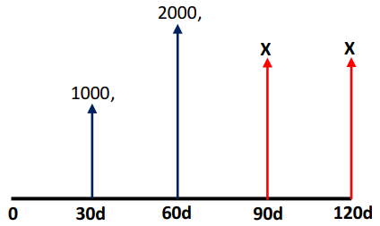
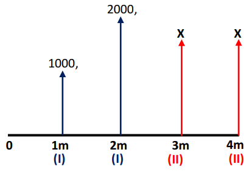
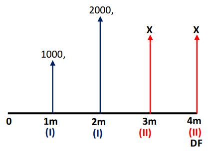
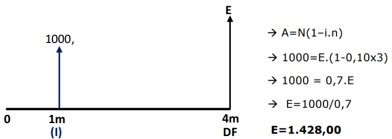
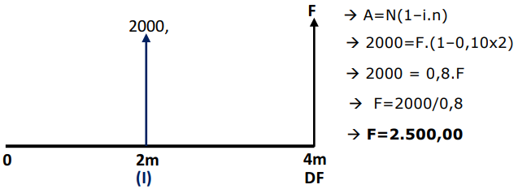
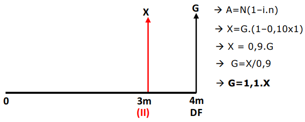
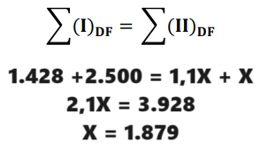

# Equivalência Simples de Capitais

Quando for apresentado duas formas diferentes de pagamento para a mesma compra.

## Exemplo de questão

- Você fez uma compra no dia de hoje, comprometendo-se a pagar R$ 1.000 daqui a 30 dias, e mais R$ 2.000  daqui a 60 dias.
- Antes de começar a pagar, poderá substituir a forma de pagar por outra.
- Duas parcelas iguais, nas datas 90 dias e 120 dias.

## Passo preliminares

### Desenhar a questão

Passar a linha do tempo, e colocar as setas de todos os valores monetários.

### Identificar as parcelas de 1ª e 2ª obrigação

- **1ª Obrigação**: parcelas da forma original de pagamento.
- **2ª Obrigação**: parcelas da nova forma de pagamento.,

### Colocar taxa e tempos na mesma unidade

Suponhamos que a operação está sujeita a 10% ao mês. Transformar 30 dias em 1 mês, etc.

### Identificar o regime e a modalidade de desconto

Toda questão de equivalência é resolvida por meio de operações de desconto!

- Identificar o **regime** do desconto (simples ou composto)
- Identificar a **modalidade** do desconto (por dentro ou por fora)

### Localizar a data focal

Na equivalência simples de capitais, quem manda na data focal é a questão.

-  Se nada disser é data zero

## Passos efetivos

### Levar para a data focal todas as parcelas

### Aplicar a equação de equivalência de capitais

A soma das parcelas da 1ª obrigação, depois de levadas para a data focal, é igual à soma das parcelas da 2ª obrigação, também depois de levadas para a data focal.

## Resumo

- Passos Preliminares de Resolução:
  - Desenhar a questão;
  - Identificar parcelas de 1ª e de 2ª obrigação;
  - Colocar taxa e tempos na mesma unidade;
  - Identificar o regime e a modalidade de desconto;
  - Localizar a data focal.
- Passos Efetivos de Resolução:
  - Transportar todas as parcelas do desenho para a data focal;
  - Aplicar a equação de equivalência.
