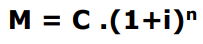
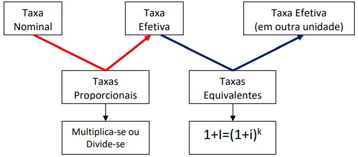
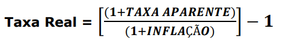

# Juro Composto

A taxa composta incidirá sempre sobre o resultado da operação no **período anterior**.

## Equação curinga dos juros

## Equação fundamental

- **C**: Capital
- **n**: Tempo
- **M**: Montante
- **J**: Juros
- **i**: Taxa

## Exigência universal

- Recorrer ao **tempo**, e tentar tronsformá-lá para a mesma unidade
  - Não pode estar fracionado
- Recorrer à **taxa**, e tentar tronsformá-la para a mesma unidade
  - Mediante uso das **Taxas Equivalentes**

## Taxas Equivalentes

- **I**: taxa de unidade maior
- **i**: taxa de unidade menor
- **k**: número de vezes que a unidade menor cabe na unidade maior

## Taxa Nominal

Taxa nominal traz consigo a palavra **capitalização**. 

- Ex: "uma taxa de 36% ao ano, com capitalização"
  - taxa anual 36% ao ano
  - unidade de capitalização é mensal
 
A **taxa nominal** é sinal indicativo de **Regime Composto**.

### Transformar taxa nominal em taxa efetiva

- a unidade da **taxa efetiva** será sempre a mesma unidade da **capitalização**.
- utiliza-se um conceito próprio do **regime simples**, que é a **Taxas Proporcionais**:
  - maior para menor = divide. Ex: 36% a.a., capitalização mensal = (36/12) = 3% ao mês
  - menor para maior = multiplica. Ex: 1% ao mês, capitalização semestral = (1 * 6) = 6% ao semestre
 
## Taxas no regime composto

## Método da Convenção Linear

É um método alternativo para se fazer uma operação de juros compostos. 

- **INT**:parte **I**nteira do tempo
- **Q**: parte **Q**uebrada do tempo

## Taxa Real x Taxa Aparente

- **Taxa Aparente**: não leva em conta a inflação acumulada no período
- **Taxa Real**: com inflação acumulada

