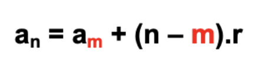

# Progressões Aritméticas

É toda sequência numérica que está sempre aumentando ou diminuindo segundo uma constante (Razão).

- (2, 4, 6, 8, ...) => Razão = 2
- (12, 9, 6, 3, 0, -3, ...) => Razão = -3

## Termos de uma PA - Termo Geral

## Encontrar razão de uma PA

Razão = Diferença Elemento / Diferença Posição

## Encontrar a quantidade de termos

Quantidade Termos = (Último - 1o) / Razão + 1

## Propriedades

- um termo qualquer pode ser calculado como a **média aritmética** entre o seu antecedente e seu consequente

 
- a soma de dois termos equidistantes dos extremos é igual à soma dos seus extremos

(1, 3, 5, 7, 9, 11, 13, 15, 17, 19) => a1 + a10= a2 + a9 => 1 + 19 = 3 + 7

## Somas dos termos

