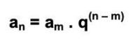
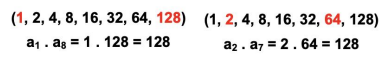

# Progressão Geométrica

É toda sequência em que cada termo, a partir do segundo, é resultado da **multiplicação do termo anterior** por uma constante q (**razão**).

(x/q, x, xq, xq2, ...)

## Encontrar qualquer termo

## Descobrir qualquer termo

Um termo qualquer é a raiz quadrada do produto do seu antecedente e seu consequente.

## Produto de termos equidistantes

O produto de dois termos **equidistantes** dos extremos é igual ao produto dos extremos.

## Soma dos termos finita

# Soma dos temos infinita

## Encontrar a razão

Q Diferença dos termos = último / primeiro

## Encontrar quantidade de termos

Q n-1 = último / primeiro

