# QUESTAO NUMERO 1

Insert the correct snippet so that the program produces the expected output.

Expected output:

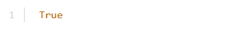

~~~Python
True
~~~

Code:

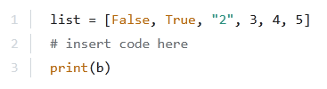

~~~Python
list = [False, True, "2", 3, 4, 5]
# insert code here

print (b)
~~~

## Topico: 1 Categoria: Data Aggregates

- (A) b = 0 not in list
- (B) b = list[0]
- (C) b = 0 in list
- (D) b = False

# QUESTAO NUMERO 2

Assuming that the tuple is a correctly created tuple, the fact that tuples are immutable means that the following instruction:

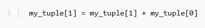

~~~Python
my_tuple[1] = my_tuple[1] + my_tuple[0]
~~~

## Topico: 1 Categoria: Data Aggregates

- (A) is illegal
- (B) may be illegal if the tuple contains strings
- (C) can be executed if and only if the tuple contains at least two elements
- (D) is fully correct

# QUESTAO NUMERO 3

What is the expected output of the following code?

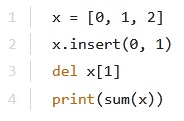

~~~Python
x = [@, 1, 2]
x.insert(@, 1)
del x[1]

print (sum(x))
~~~

## Topico: 1 Categoria: Data Aggregates

- (A) 2
- (B) 4
- (C) 5
- (D) 3

# QUESTAO NUMERO 4

What is the expected output of the following code?

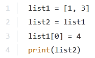

~~~Python
list1 = [1, 3]
list2 = list1
list1[@] = 4
print (list2)
~~~

## Topico: 1 Categoria: Data Aggregates

- (A) [1, 3]
- (B) [1, 4]
- (C) [4, 3]
- (D) [1, 3, 4]

# QUESTAO NUMERO 5

What is the expected output of the following code?

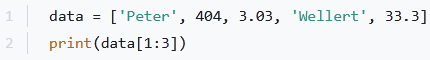

~~~Python
data = [‘Peter’, 404, 3.03, ‘Wellert’, 33.3]
print (data[1:3])
~~~

## Topico: 1 Categoria: Data Aggregates

- (A) ['Peter', 404, 3.03, 'Wellert', 33.3]
- (B) None of the above.
- (C) [404, 3.03]
- (D) ['Peter', 'Wellert']

# QUESTAO NUMERO 6

Take a look at the snippet, and choose the true statements: (Choose two.)

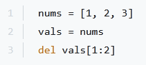

~~~Python
nums

[4, 2, 3]
vals = nums

del vals[1:2]
~~~

## Topico: 1 Categoria: Data Aggregates

- (A) nums is longer than vals
- (B) nums and vals are of the same length
- (C) vals is longer than nums
- (D) nums and vals refer to the same list

# QUESTAO NUMERO 7

What is the output of the following snippet?

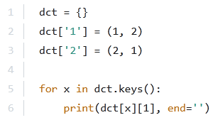

~~~Python
det = {}
det['1'] = (4, 2)
det['2'] = (2, 1)

for x in det.keys():
print(det[x][1], end="')
~~~

## Topico: 1 Categoria: Data Aggregates

- (A) 12
- (B) (2, 1)
- (C) (1, 2)
- (D) 21

# QUESTAO NUMERO 8

What is the expected output of the following code?

print(list('hello'))

## Topico: 1 Categoria: Data Aggregates

- (A) hello
- (B) [h, e, l, l, o]
- (C) ['h', 'e', 'l', 'l', 'o']
- (D) ['h' 'e' 'l' 'l' 'o']
- (E) None of the above.

# QUESTAO NUMERO 9

What will be the output of the following code snippet?

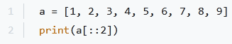

~~~Python
a=[1, 2, 3, 4, 5, 6, 7, 8, 9]
print(a[::2])
~~~

## Topico: 1 Categoria: Data Aggregates

- (A) [1, 3, 5, 7, 9]
- (B) [8, 9]
- (C) [1, 2, 3]
- (D) [1, 2]

# QUESTAO NUMERO 10

What will be the output of the following code snippet?

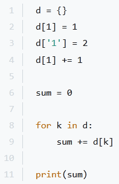

~~~Python
d= {}
d[a] = 2
d['a'} =2
d[a] += 1

sum = @

for k in d:
sum += d[k]

print (sum)
~~~

## Topico: 1 Categoria: Data Aggregates

- (A) 3
- (B) 2
- (C) 4
- (D) 1

# QUESTAO NUMERO 11

What is the output of the following snippet?

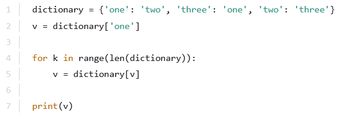

~~~Python
dictionary = {‘one': ‘two’, ‘three’: ‘one’, ‘two': 'three'}

v = dictionary[ ‘one']

for k in range(len(dictionary)

v = dictionary[v]

print (v)
~~~

## Topico: 1 Categoria: Data Aggregates

- (A) two
- (B) one
- (C) (‘one’, ‘two’, ‘three’)
- (D) three

# QUESTAO NUMERO 12

What is the expected output of the following code?

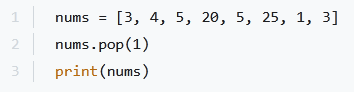

~~~Python
nums = [3, 4, 5, 20, 5, 25, 1, 3]
nums.. pop(1)

print (nums)
~~~

## Topico: 1 Categoria: Data Aggregates

- (A) [3, 1, 25, 5, 20, 5, 4]
- (B) [1, 3, 4, 5, 20, 5, 25]
- (C) [3, 5, 20, 5, 25, 1, 3]
- (D) [1, 3, 3, 4, 5, 5, 20, 25]
- (E) [3, 4, 5, 20, 5, 25, 1, 3]

# QUESTAO NUMERO 13

Which of the following sentences is true?

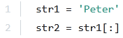

~~~Python
stri = ‘Peter’
str2 = stri[:]
~~~

## Topico: 1 Categoria: Data Aggregates

- (A) str1 and str2 are different (but equal) strings.
- (B) str1 and str2 are different names of the same strings.
- (C) str1 is longer than str2
- (D) str2 is longer than str1

# QUESTAO NUMERO 14

The fact that tuples belong to sequence types means:

## Topico: 1 Categoria: Data Aggregates

- (A) they can be modified using the del instruction
- (B) they can be extended using the .append() method
- (C) they are actually lists
- (D) they can be indexed and sliced like lists

# QUESTAO NUMERO 15

What is the output of the following code?

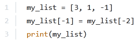

~~~Python
my_list = [3, 1, -4]
my_list[-1] = my_list[-2]
print(my_list)
~~~

## Topico: 1 Categoria: Data Aggregates

- (A) [1, 1, 1]
- (B) [3, -1, 1]
- (C) [3, 1, 1]

# QUESTAO NUMERO 16

What is the expected output of the following code?

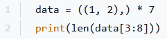

~~~Python
data = ((1, 2),) *7
print (1en(data[3:8]))
~~~

## Topico: 1 Categoria: Data Aggregates

- (A) The code is erroneous.
- (B) 6
- (C) 5
- (D) 4

# QUESTAO NUMERO 17

What is the expected output of the following code?

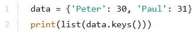

~~~Python
data = {'Peter': 30, 'Paul': 31}
print (list (data.keys()))
~~~

## Topico: 1 Categoria: Data Aggregates

- (A) ('Peter': 30, 'Paul': 31)
- (B) ('Peter', 'Paul')
- (C) ['Peter': 30, 'Paul': 31]
- (D) ['Peter', 'Paul']

# QUESTAO NUMERO 18

What is the output of the following snippet?

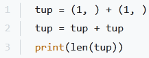

~~~Python
tup = (1, ) + (1, )

tup = tup + tup

print (len(tup))
~~~

## Topico: 1 Categoria: Data Aggregates

- (A) 2
- (B) 4
- (C) The snippet is erroneous (invalid syntax)

# QUESTAO NUMERO 19

What is the expected output of the following code?

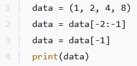

~~~Python
data = (1, 2, 4, 8)
data = data[-2:-1]
data = data[-1]

print (data)
~~~

## Topico: 1 Categoria: Data Aggregates

- (A) (4)
- (B) 4
- (C) (4,)
- (D) 44

# QUESTAO NUMERO 20

What is the output of the following snippet?

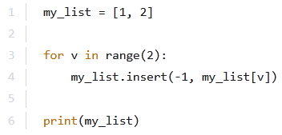

~~~Python
my_list = [1, 2]

for v in range(2):

my_list.insert(-1, my_list[v])

print(my_list)
~~~

## Topico: 1 Categoria: Data Aggregates

- (A) [1, 1, 2, 2]
- (B) [1, 1, 1, 2]
- (C) [1, 2, 1, 2]
- (D) [1, 2, 2, 2]

# QUESTAO NUMERO 21

What is the expected output of the following code?

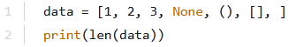

~~~Python
data = [1, 2, 3, None, (), [1], ]
print(1en(data))
~~~

## Topico: 1 Categoria: Data Aggregates

- (A) 4
- (B) 6
- (C) 5
- (D) 3

# QUESTAO NUMERO 22

A data structure described as LIFO is actually a:

## Topico: 1 Categoria: Data Aggregates

- (A) stack
- (B) tree
- (C) list
- (D) heap

# QUESTAO NUMERO 23

How would you remove all the items from the d dictionary?

Expected output:

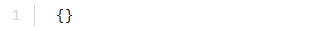

~~~Python
cea
~~~

Code:

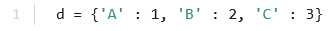

~~~Python

~~~

## Topico: 1 Categoria: Data Aggregates

- (A) d.del()
- (B) d.remove()
- (C) del d
- (D) d.clear()

# QUESTAO NUMERO 24

What is the expected output of the following code?

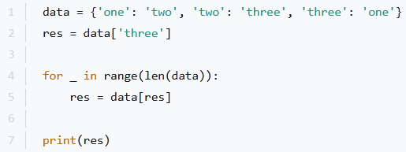

~~~Python
data = {'one': 'two', 'two': ‘three’, ‘three’: ‘one'}

res = data[‘three']

for _ in range(len(data)):

res = data[res]

print(res)
~~~

## Topico: 1 Categoria: Data Aggregates

- (A) three
- (B) ('one', 'two', 'three')
- (C) two
- (D) one

# QUESTAO NUMERO 25

What is the expected output of the following code?

~~~Python
data = {'name': ‘Peter’, ‘age’: 30}
person = data.copy()
print(id(data)

id(person))
~~~

## Topico: 1 Categoria: Data Aggregates

- (A) False
- (B) 1
- (C) 0
- (D) True

# QUESTAO NUMERO 26

Which one of the lines should you put in the snippet below to match the expected output?

Expected output:

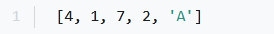

~~~Python
[4, 1, 7, 2, 'A°]
~~~

Code:

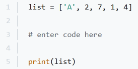

~~~Python
list = ['A', 2, 7, 1, 4]

# enter code here

print(list)
~~~

## Topico: 1 Categoria: Data Aggregates

- (A) reverse(list)
- (B) list.reversed()
- (C) list.reverse()
- (D) reversed(list)

# QUESTAO NUMERO 27

What is the expected output of the following code?

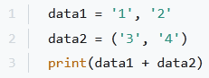

~~~Python
datal = '1', '
data2 = ('3', '4')
print(datal + data2)
~~~

## Topico: 1 Categoria: Data Aggregates

- (A) ['1', '2', '3', '4']
- (B) (1, 2, 3, 4)
- (C) ('1', '2', '3', '4')
- (D) The code is erroneous.

# QUESTAO NUMERO 28

What is the expected output of the following code?

~~~Python
data = (1, 2, 4, 8)
data = data[1:-1]
data = data[0]

print (data)
~~~

## Topico: 1 Categoria: Data Aggregates

- (A) (2)
- (B) (2,)
- (C) 2
- (D) The code is erroneous.

# QUESTAO NUMERO 29

What is the output of the following snippet?

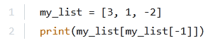

~~~Python
my_list = [3, 1, -2]
print(my_list[my_list[-1]])
~~~

## Topico: 1 Categoria: Data Aggregates

- (A) -2
- (B) 3
- (C) -1
- (D) 1

# QUESTAO NUMERO 30

An alternative name for a data structure called a stack is:

## Topico: 1 Categoria: Data Aggregates

- (A) LIFO
- (B) FIFO
- (C) FOLO
