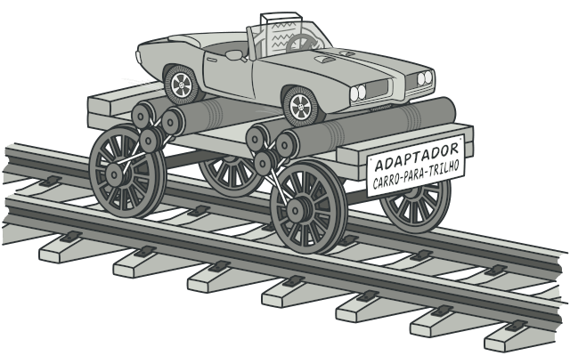
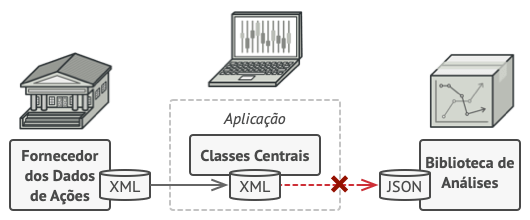
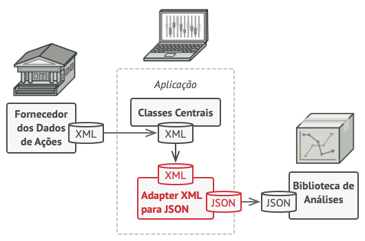

- [Adapter](https://refactoring.guru/pt-br/design-patterns/adapter): O Adapter é um padrão de projeto estrutural que permite objetos com interfaces incompatíveis colaborarem entre si.

# Padrões Estruturais - Adapter

O Adapter é um padrão de projeto estrutural que permite objetos com interfaces incompatíveis colaborarem entre si.

## Problema

Imagine que você está criando uma aplicação de monitoramento do mercado de ações da bolsa. A aplicação baixa os dados as ações de múltiplas fontes em formato XML e então mostra gráficos e diagramas maneiros para o usuário.

Em algum ponto, você decide melhorar a aplicação ao integrar uma biblioteca de análise de terceiros. Mas aqui está a pegadinha: a biblioteca só trabalha com dados em formato JSON.

Você poderia mudar a biblioteca para que ela funcione com XML. Contudo, isso pode quebrar algum código existente que depende da biblioteca. E pior, você pode não ter acesso ao código fonte da biblioteca para começo de conversa, fazendo dessa abordagem uma tarefa impossível.

## Solução

Você pode criar um adaptador. Ele é um objeto especial que converte a interface de um objeto para que outro objeto possa entendê-lo.

Um adaptador encobre um dos objetos para esconder a complexidade da conversão acontecendo nos bastidores. O objeto encobrido nem fica ciente do adaptador. Por exemplo, você pode encobrir um objeto que opera em metros e quilômetros com um adaptador que converte todos os dados para unidades imperiais tais como pés e milhas.

Adaptadores podem não só converter dados em vários formatos, mas também podem ajudar objetos com diferentes interfaces a colaborar. Veja aqui como funciona:

1. O adaptador obtém uma interface, compatível com um dos objetos existentes.
2. Usando essa interface, o objeto existente pode chamar os métodos do adaptador com segurança.
3. Ao receber a chamada, o adaptador passa o pedido para o segundo objeto, mas em um formato e ordem que o segundo objeto espera.

Algumas vezes é possível criar um adaptador de duas vias que pode converter as chamadas em ambas as direções.

