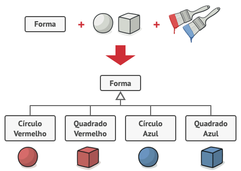
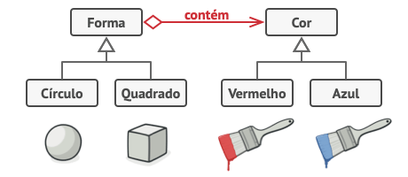

- [Bridge](https://refactoring.guru/pt-br/design-patterns/bridge): O Bridge é um padrão de projeto estrutural que permite que você divida uma classe grande ou um conjunto de classes intimamente ligadas em duas hierarquias separadas—abstração e implementação—que podem ser desenvolvidas independentemente umas das outras.

# Padrões Estruturais - Bridge

O Bridge é um padrão de projeto estrutural que permite que você divida uma classe grande ou um conjunto de classes intimamente ligadas em duas hierarquias separadas—abstração e implementação—que podem ser desenvolvidas independentemente umas das outras.

## Problema

Adicionar novos tipos de forma e cores à hierarquia irá fazê-la crescer exponencialmente. Por exemplo, para adicionar uma forma de triângulo você vai precisar introduzir duas subclasses, uma para cada cor. E depois disso, adicionando uma nova cor será necessário três subclasses, uma para cada tipo de forma. Quanto mais longe vamos, pior isso fica.

## Solução

Esse problema ocorre porque estamos tentando estender as classes de forma em duas dimensões diferentes: por forma e por cor. Isso é um problema muito comum com herança de classe.

O padrão Bridge tenta resolver esse problema ao trocar de herança para composição do objeto. Isso significa que você extrai uma das dimensões em uma hierarquia de classe separada, para que as classes originais referenciem um objeto da nova hierarquia, ao invés de ter todos os seus estados e comportamentos dentro de uma classe.

