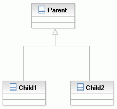
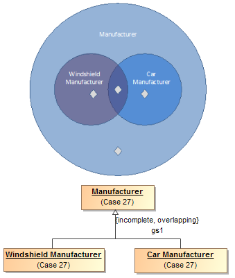
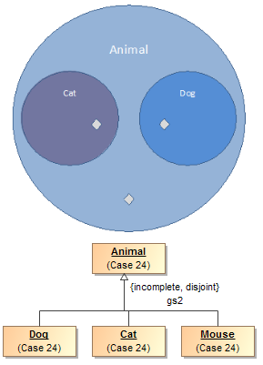
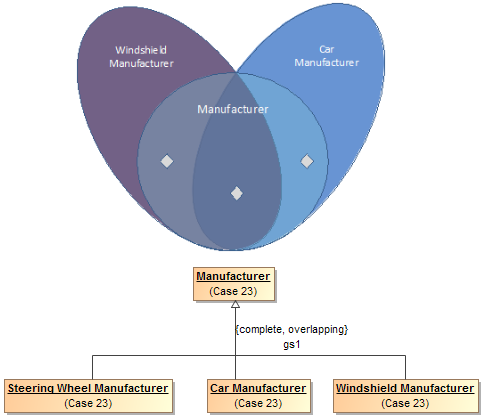
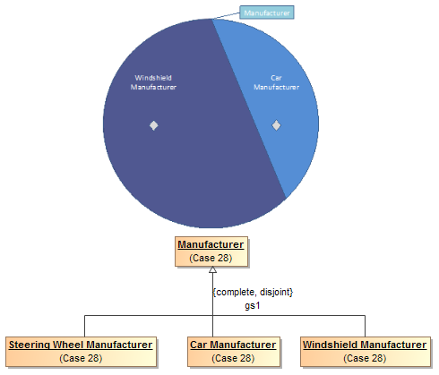

- [Relacionamentos de Generalização](https://www.ibm.com/docs/pt-br/rsm/7.5.0?topic=diagrams-generalization-relationships): Na modelagem UML, um relacionamento de generalização é aquele no qual um elemento de modelo (o filho) tem como base outro elemento de modelo (o pai). Os relacionamentos de generalização são utilizados em diagramas de classe, componente, implementação e caso de uso para indicar que o filho recebe todos os atributos, operações e relacionamentos definidos no pai.

# UML: Relacionamento de Generalização

É aquele no qual um elemento de modelo (o filho) tem como base outro elemento de modelo (o pai).

## Overlapping and incomplete subclasses

## Disjoint subclasses

## Complete

## Disjoint and complete

