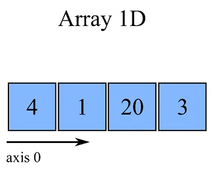
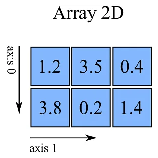
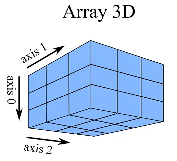

- [Tipo ndarray do módulo NumPy](https://panda.ime.usp.br/algoritmos/static/algoritmos/10-numpy.html): A medida que escrevemos nossas próprias classes e funções, podemos acelerar o desenvolvimento de outros programas reutilizando as funções e módulos já escritos e testados.
- [Numpy Python O que é, vantagens e tutorial inicial](https://harve.com.br/blog/programacao-python-blog/numpy-python-o-que-e-vantagens-e-tutorial-inicial/): Na área de ciência de dados com Python certamente você já se deparou com a biblioteca do NumPy.
- [Operadores em Python: Aprenda tudo sobre os operadores na linguagem de programação Python](https://awari.com.br/operadores-em-python-aprenda-tudo-sobre-os-operadores-na-linguagem-de-programacao-python/): Neste artigo, você aprenderá tudo sobre os operadores em Python.

# Array - ndarray

Eficiente na questão da memória que provê operações numéricas rápidas.

## Python List para Array

### Array 1D

~~~python
array = np.array([4,1,20,3]) 
# [4,1,20.3]
# array.shape => (4,0)
~~~

### Array 2D

~~~python
array = np.array([ [1.2,3.5,0.4], [3.8,0.2,1.4] ]) 
// [[1.2 3.5 0.4] , [3.8 0.2 1.4]]
// array.shape => (2, 3)
~~~

### Array 3D

## Operações em array

a = np.array([1, 2, 3])

- a + 2  => [3 4 5]
- a * 3  => [3 6 9]

## Opereradores de comparação

a = np.array([1, 2, 3])

- a > 2  => [false, false, true]
- a == 2  => [false, true, false]
