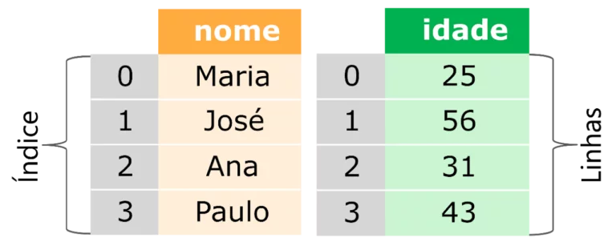
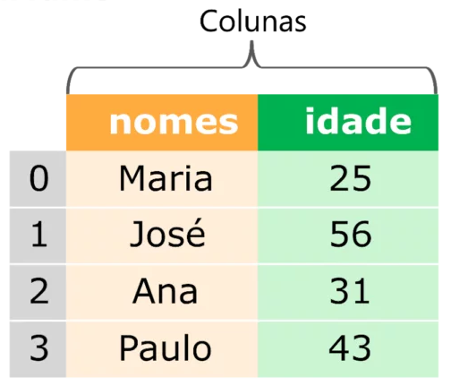

- [Pandas Python: vantagens e como começar](https://harve.com.br/blog/programacao-python-blog/pandas-python-vantagens-e-como-comecar/): Com toda a certeza se você, entusiasta na área de ciência de dados, já procurou como ler ou fazer análises em um conjunto de dados utilizando a linguagem Python se deparou com o nome Pandas.
- [Pandas Python: o que é, para que serve e como instalar](https://www.alura.com.br/artigos/pandas-o-que-e-para-que-serve-como-instalar): A Ciência de Dados é um ramo que vem ganhando cada vez mais notoriedade, várias empresas de pequeno a grande porte, como a Netflix, Airbnb e Google já possuem atividades de tomada de decisão baseadas em dados.

# Pandas

Pandas é uma biblioteca para uso em Python, open-source e de uso gratuito (sob uma licença BSD), que fornece ferramentas para análise e manipulação de dados.

O pandas permite trabalhar com diferentes tipos de dados, por exemplo:

- Dados tabulares, como uma planilha Excel ou uma tabela SQL;
- Dados ordenados de modo temporal ou não;
- Matrizes;
- Qualquer outro conjunto de dados, que não necessariamente precisem estar rotulados;

## Estrutura de dados - Serie

É uma matriz unidimensional que contém uma sequência de valores que apresentam uma indexação (que podem ser numéricos inteiros ou rótulos), muito parecida com uma única coluna no Excel.

## Estrutura de dados - DataFrame

É uma estrutura de dados tabular, semelhante a planilha de dados do Excel, em que tanto as linhas quanto as colunas apresentam rótulos.

